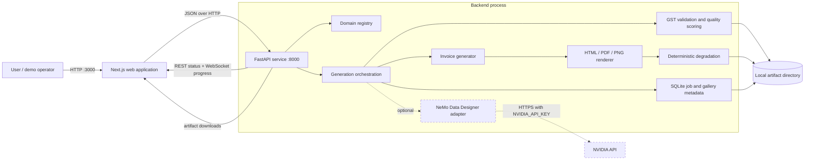
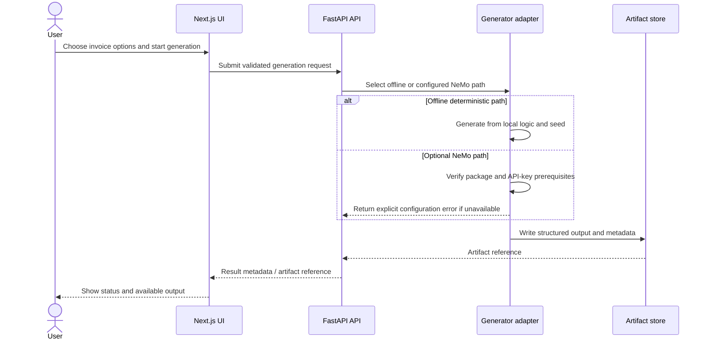

# Architecture

## Scope

NV-SynthForge separates user interaction, generation orchestration, provider adapters, and artifact storage. The MVP is deliberately local-first: deterministic offline generation is the baseline, while NVIDIA NeMo Data Designer and native rendering remain optional, environment-dependent integrations.

Dashed edges are optional. The offline structured-data, rendering, degradation, export, persistence, and deterministic benchmark paths work without an NVIDIA credential. WeasyPrint can improve HTML-to-PDF fidelity, while ReportLab is the portable PDF baseline.

## Component responsibilities

| Component | Responsibility | Boundary |
| --- | --- | --- |
| Next.js frontend | Collect generation options, display registry state and results, call the API | Does not generate datasets or hold server secrets |
| FastAPI service | Validate requests, expose registry/generation endpoints, coordinate providers and artifacts | API contract is the integration boundary |
| Domain registry | Describe available and planned domains | A registry entry is metadata, not proof of generator availability |
| Invoice generator | Produce the current MVP's structured invoice records | Deterministic behavior should be seed-driven |
| NeMo adapter | Invoke NVIDIA NeMo Data Designer when explicitly selected and configured | Requires package compatibility, network access, and `NVIDIA_API_KEY` |
| Native renderer | Convert invoices to HTML, PDF, PNG, and deterministic degraded JPEG images | ReportLab/Pillow baseline; WeasyPrint is optional for higher-fidelity HTML-to-PDF output |
| Artifact and metadata store | Persist exports, rendered files, jobs, gallery documents, and benchmark inputs | Local filesystem plus SQLite in development; not durable on Cloud Run |

## Primary request flow

Endpoint names and payload fields are intentionally omitted here; the running FastAPI OpenAPI document at `/docs` is authoritative.

## Deployment topology

### Local development

- Frontend: host port `3000`
- Backend: host port `8000`
- Artifacts: bind-mounted `./artifacts`
- Credentials: local `.env`, ignored by Git

### Cloud Run

Deploy the backend and frontend as separate services. Cloud Run's writable filesystem is ephemeral, so a production artifact workflow needs object storage or another durable store. The MVP's local artifact store should be treated as demo-only on Cloud Run. See [CLOUD_RUN.md](CLOUD_RUN.md).

## Trust and security boundaries

1. `NVIDIA_API_KEY` is server-only and must never use a `NEXT_PUBLIC_*` name.
2. Browser input is untrusted; the API must perform authoritative validation.
3. Generated artifacts are untrusted data when consumed downstream.
4. Artifact identifiers must not permit path traversal or arbitrary file reads.
5. Renderer and provider failures should return explicit errors rather than silently changing generation modes.
6. The web service and API need explicit allowed origins in non-local deployments.

## Current limitations

- Invoice generation is the MVP implementation focus; other registered domains may be descriptive only.
- Local filesystem persistence is not horizontally scalable or durable in serverless deployments.
- No claim is made for production authentication, tenant isolation, quotas, or billing.
- NeMo behavior depends on an external package/API and cannot be assumed in offline CI.
- Native rendering depends on renderer-specific libraries and can differ across Windows, Linux, and containers.
